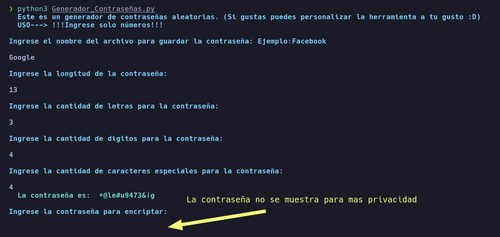
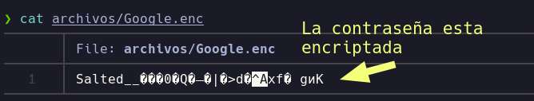
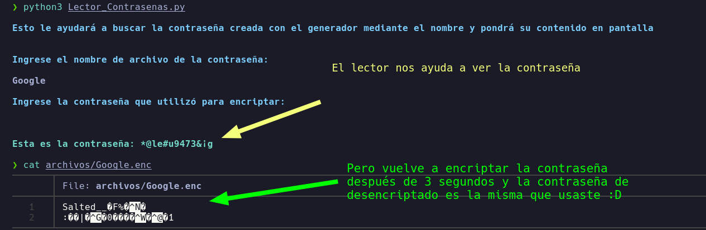

#Herramienta escrita en python3 para generar contraseñas aleatorias*

##Instalación

**Crear una carpeta con permisos 700 y propietario unicamente root**

``` 
git clone https://github.com/CyberDemonWH19/Generador-contrasenas-ES-python3.git
sudo chown root:root Generador-contraseñas-ES-python3 && chmod 700 Generador-contrasenas-ES-python3
cd Generador-contrasenas-ES-python3
```

**Usar como root**

```
pip3 install colorama
python3 Generador_Contraseñas.py

```



**Digite lo que se le pide :D**



**El lector es por si tienes demasiados archivos de contraseñas y necesitas buscar una rapidamente.**
**Además es el descifrador.**

** Usar como Root o usar sudo**

```
python3 Lector_Contrasenas.py
```



**Y eso es todo, puedes modificar la herramienta a tu gusto como dirigir las contraseñas a una base de datos, etc.**
